

# 
Entrega de proyecto final

@Alumno: Soledad Bustos Aguiar

@Comision: 53180

@Tutor: Santiago Angel Gonzalez Martin

@Docente: Anderson Michel Torres Ocaña

---

### **Consignas:**
- La base de datos debe contener al menos:
    * ~ 15 tablas, entre las cuales debe haber al menos 1 tabla de hechos,  2 tablas transaccionales.
    * ~ 5 vistas.
    * ~ 2 stored procedure.
    * ~ 2  trigger.
    * ~ 2 funciones
    
- El documento debe contener:
    - Introducción
    - Objetivo
    - Situación problemática
    - Modelo de negocio
    - Diagrama de entidad relació
    - Listado de tablas con descripción de estructura (columna,descripción, tipo de datos, tipo de clave)
    - Scripts de creación de cada objeto de la base de datos
    - Scripts de inserción de datos
    - Informes generados en base a la información de la base
    - Herramientas y tecnologías usadas

---

## Tematica del proyecto
El CINE de nuestra ciudad necesita sistematizar la gestión de ventas y reservas de entradas.

Objetivo: Gestionar de manera eficiente la operación y administración de dos complejos de cines ubicados en Shopping Terminal y Shopping Alto del Solar. Esto incluye la programación centralizada y semanal de las películas, la administración de la capacidad y uso de las salas, la venta de entradas cumpliendo con las normativas legales, y la optimización de la experiencia del cliente mediante la correcta asignación de películas, horarios y precios según diferentes factores como tipo de función, calificación de la película y tipo de entrada.
## Modelo de negocio
El cine estará integrado por dos complejos, ubicados en Shopping Terminal y en Shopping Alto del Solar. Cada cine cuenta con una cantidad de salas, que son las que exhiben las películas en las distintas funciones cinematográficas. La programación de las salas se renueva en forma semanal, existiendo la posibilidad de que algunas salas queden sin uso. Cabe mencionar que no todas las salas tienen la misma capacidad (cantidad de butacas).
La programación es la que determina qué películas van a proyectarse y los horarios para cada función de cada una de las salas, para los cines. Esta programación se realiza en forma centralizada, desde la administración del Complejo, tomándose como base la información de las películas próximas a estrenar, que envía el INCAA (Instituto Nacional de Cines y Artes Audiovisuales). La programación implica el diseño de las funciones y sus horarios en forma anticipada, debiendo el responsable de la misma, habilitar cada función en el momento que desee permitir la reserva y/o venta de entradas para la misma.
La entrada que se le entrega al cliente representa el comprobante de venta y como tal debe cumplir con lo reglamentado en la Ley de Facturación vigente, debiendo contener como datos: nro. de venta, fecha de venta, número de función, sala en la que se proyecta la película, el nombre de la película, fecha y hora de la función, el precio,  el tipo de entrada (si es mayor, menor, jubilado) y la calificación de la película, que según especificaciones de la Ley de Cine Nro. 17.741, debe ser informada tanto en la entrada como al inicio de la película. Es importante destacar que la entrada es válida únicamente para la fecha, hora y función indicadas en la misma. 
Los tipos de entradas y los días y horarios de proyección son los que determinan el precio de la entrada, que también pueden variar en cada cine del complejo. Las funciones admiten ciertos tipos de entradas y otros no, dependiendo de factores como: horarios, calificación de las películas, etc. Por ejemplo: si una película está calificada como para mayores de 16 años, para esa función no se pueden vender entradas de TIPO = MENOR. Cada función tiene asociado un tipo de función, que determina si la función es un pre estreno, un estreno o una función normal.

## Diagrama entidad relacion (DER)

## Listado de tablas y descripcion
El script para la creación y definición de la base de datos se encuentra en el archivo database_structure.sql, ubicado en la carpeta structure.

A continuación se presenta la descripción de cada una de las tablas de la base de datos.

* Tabla 1: actor

* Tabla 2: calificacion

* Tabla 3: cine

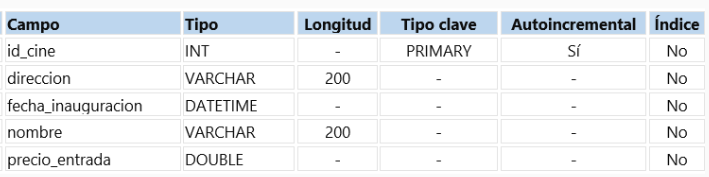

* Tabla 4: entrada

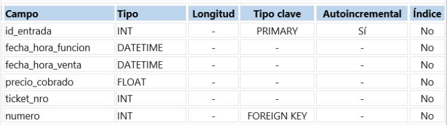

* Tabla 5: funcion

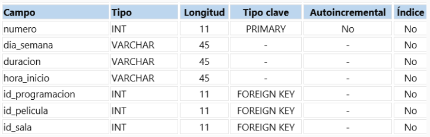

* Tabla 6: genero

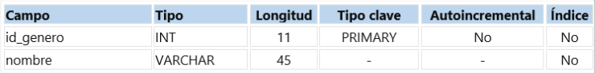

* Tabla 7: horariofuncion

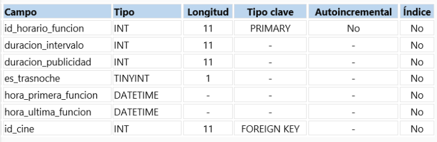

* Tabla 8: paisdeorigen

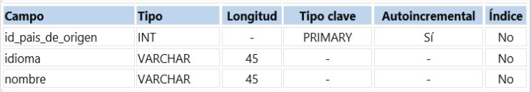

* Tabla 9: pelicula

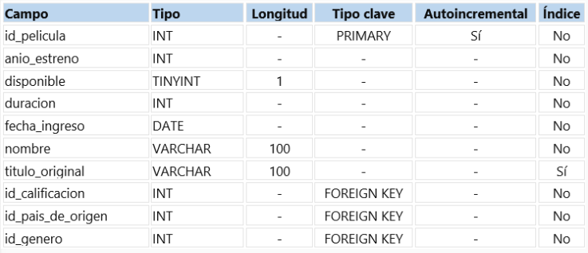

* Tabla 10: personaje

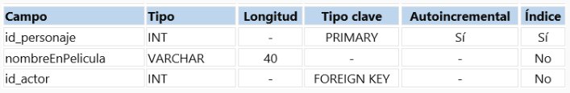

* Tabla 11: programacion

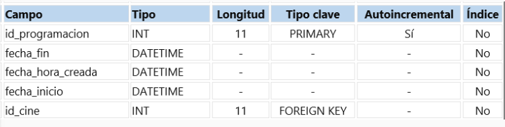

* Tabla 12: reparto

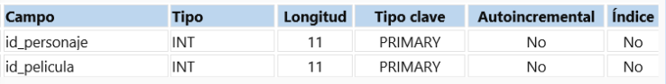

* Tabla 13: rol

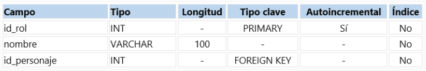

* Tabla 14: sala

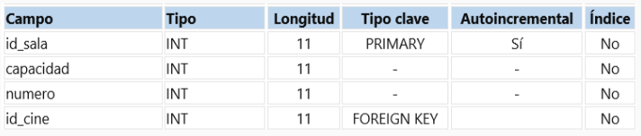

* Tabla 15: sexo

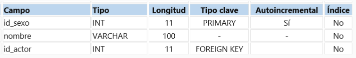

## Estructura e ingesta de datos

* La ingesta de datos en las tablas dimensionales: actor, calificacion, cine, entrada, funcion, genero, horariofuncion, paisdeorigen, pelicula, personaje, programacion, reparto, rol, sala, sexo. Se realiza por medio del archivo population.sql que se encuentra en la carpeta structure.

* La ingesta de datos de la tabla: log_pelicula_audi. Se realiza por medio del procedimiento almacenado crear_estructura_auditoria_peliculas() 

## Objetos de la base de datos
Los objetos de la base de datos se encuentran en la carpeta objects, con un archivo sql para cada tipo de objeto:

1. Vistas: views.sql
2. Funciones: functions.sql
3. Prodecimientos almacenados: store_procedures.sql
4. Triggers: triggers.sql
5. Roles, permisos y usuarios: roles_users.sql

En el archivo Makefile: se definió el orden de los objetos 

A continuación, se desarrolla la documentación de cada uno de ellos.
* Vistas:

1.vista_programacion_cine
Se crea para proporcionar una representación combinada de los datos de las tablas:
.programacion 
.cine
La vista se utiliza para obtener información sobre la programación de películas en relación con los cines donde se proyectan.

2.vista_pelicula_informacion
Se crea para proporcionar una representación combinada de los datos de las tablas:
.-pelicula 
.-calificacion
.-paisdeorigen 
.-genero. 
La vista se utiliza para obtener información detallada sobre las películas, incluyendo su calificación, país de origen y género.

3.vista_peliculas_x_funciones
Se crea para proporcionar una representación combinada de los datos de las tablas:
.-funcion
.-pelicula
La vista se utiliza para obtener información detallada sobre las películas programadas para cada función en un cine

4.vista_disponibilidad_salas_x_cines
Se crea para proporcionar una representación combinada de los datos de las tablas:
.-sala
.-cine
La vista se utiliza para obtener información detallada sobre la disponibilidad de salas en cada cine.

5.vista_pelicula_ingles
Se crea para proporcionar una representación combinada de los datos de las tablas:
.-idioma
.-paisdeorigen
La vista se utiliza para obtener información detallada sobre las películas cuyo país de origen es inglés. 

* Funciones

## Roles y permisos
* Se generaron tres roles:

1. role_select_vistas: Este rol tiene permisos solo para leer las vistas.
2. role_crud_pelicula: Este rol tiene permisos para generar CRUD en toda la base de datos.
3. role_all_select_all_table: Este rol tiene permisos para leer todas las tablas de la base de datos.

* Se asignaron los privilegios:

1. Selección al role_select_vistas
2. CRUD al role_crud_pelicula
3. Selección role_all_select_all_table

* Se creó el usuario: 'admin_super_cine'

Todos los roles, permisos y usuarios: se definen en el archivo roles_users.sql

## Back up de la base de datos
El backup generado se encuentra en la carpeta backups.

## Herramientas y tecnologias usadas
* MySQL (gestor de bases de datos, version 8.0.36)
* MySQL Workbench (interfaz gráfica, version 8.0.36)
* Slide, Google Drive y Meet Google (primera y segunda entrega)
* https://mockaroo.com/ (para generar datos ficticios)
* Makefile (genera una interfaz sencilla de procesos)
* Docker (genera container)
* GitHub (entrega proyecto final)
## Como levantar el proyecto en CodeSpaces GitHub
* env: Archivo con contraseñas y data secretas
* Makefile: Abstracción de creacción del proyecto
* docker-compose.yml: Permite generar las bases de datos en forma de contenedores

#### Pasos para arrancar el proyecto
En la terminal escribir :
* make si te da un error de que no conexion al socket, volver al correr el comando make
* make clean-db limpiar la base de datos
* make test-db para mirar los datos de cada tabla
* make backup-db para realizar un backup de mi base de datos
* make access-db para acceder a la base de datos